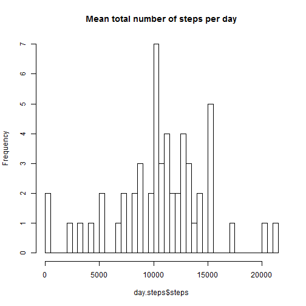
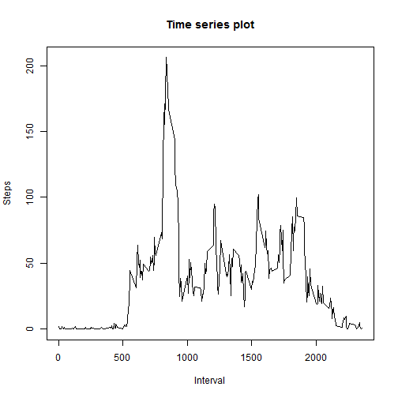

# Reproducible Research: Peer Assessment 1
setwd("/Documentation/Video Trainings/InProgress/Data Science Track/Reproducible Research/Assignments/AS1/RepData_PeerAssessment1")

## Loading and preprocessing the data

```r
activity <- read.csv("activity.csv")
activity$date <- as.Date(activity$date)
summary(activity)
```

```
##      steps            date               interval   
##  Min.   :  0.0   Min.   :2012-10-01   Min.   :   0  
##  1st Qu.:  0.0   1st Qu.:2012-10-16   1st Qu.: 589  
##  Median :  0.0   Median :2012-10-31   Median :1178  
##  Mean   : 37.4   Mean   :2012-10-31   Mean   :1178  
##  3rd Qu.: 12.0   3rd Qu.:2012-11-15   3rd Qu.:1766  
##  Max.   :806.0   Max.   :2012-11-30   Max.   :2355  
##  NA's   :2304
```

```r
day.steps <- aggregate(steps ~ date, data = activity, sum)
```


## What is mean total number of steps taken per day?

```r
mean(day.steps$steps, na.rm = T)
```

```
## [1] 10766
```

```r

hist(day.steps$steps, breaks = 50, main = "Mean total number of steps per day", 
    freq = T)
```

 

### Median total number of steps, taken per day:

```r
median(day.steps$steps, na.rm = T)
```

```
## [1] 10765
```

## What is the average daily activity pattern?

```r
int.steps <- aggregate(steps ~ interval, data = activity, mean)
plot(int.steps$interval, int.steps$steps, type = "l", xlab = "Interval", ylab = "Steps", 
    main = "Time series plot")
```

 


## Imputing missing values

```r
ok <- complete.cases(activity)
sum(!ok)
```

```
## [1] 2304
```


## Are there differences in activity patterns between weekdays and weekends?

```r

activity$wdays <- ifelse(weekdays(activity$date) %in% c("Saturday", "Sunday"), 
    "weekend", "weekday")
steps <- aggregate(steps ~ interval + wdays, data = activity, mean)
library(lattice)
xyplot(steps ~ interval | wdays, data = steps, type = "l", layout = c(1, 2), 
    xlab = "Interval", ylab = "Number of steps")
```

 

;
